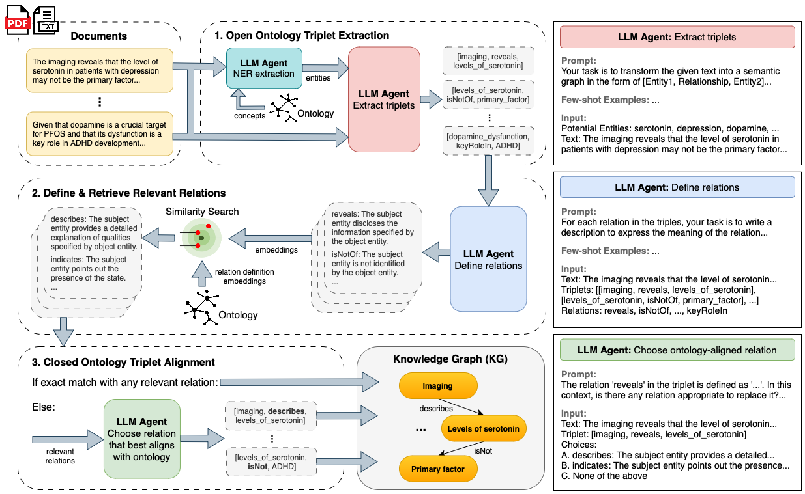

<h1>Brain2KG: A Multi-Agent Framework for Neuroscience Knowledge Graph Construction</h1>



## Brain2KG Overview

This pipeline leverages multiple agents to process neuroscience documents, extracting, defining, and aligning triplet relations with a predefined ontology. The result is a knowledge graph (KG) that is consistent with the given ontology, ensuring accurate representation of the extracted information.

## Framework Stages

### OIE: Open Information Extraction

In the first stage, neuroscience documents are fed into the framework. An LLM agent performs Named Entity Recognition (NER) to identify relevant entities within the text. These entities are then used to extract triplets in the form `[Entity1, Relationship, Entity2]`. This process transforms unstructured text into structured data, forming the initial set of triplets.

### SD: Schema Definition

The second stage involves defining and retrieving relevant relations for the extracted triplets. The LLM agent defines the relationships within the triplets by providing descriptions that express the meaning of each relation. Using similarity search, these relation definitions are then embedded and compared to the ontology embeddings to find the most relevant matches.

### SA: Schema Alignment

In the final stage, the defined triplets are aligned with the predefined ontology. The LLM agent selects the best matching relations from the ontology for each triplet. If an exact match is not found, the agent chooses the closest relevant relation. This process ensures that the triplets are consistent with the given ontology, resulting in an ontology-aligned knowledge graph (KG) that accurately represents the extracted information.

## Dependencies

Install requirements using a poetry environment:

```bash
poetry install
```

## Usage Instructions

Run Brain2KG by executing `poetry run python run.py --options`:

```bash
poetry run python run.py \
    --oie_llm {oie_llm} \
    --oie_few_shot_example_file_path {oie_few_shot_example_file_path} \
    --sd_llm {sd_llm} \
    --sd_few_shot_example_file_path {sd_few_shot_example_file_path} \
    --sa_target_schema_file_path {sa_target_schema_file_path} \
    --sa_llm {sa_llm} \
    --sa_embedding_model {sa_embedding_model} \
    --input_text_file_path {input_text_file_path} \
    --output_dir {output_dir}
```

## Checklist

- [ ] Replace `ollama` instruct and embedding components with `transformers`
